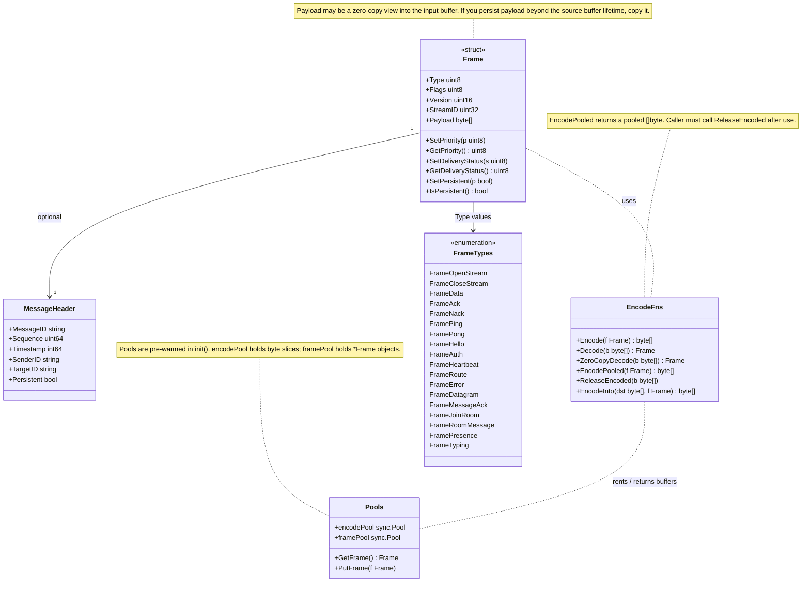

```mermaid
classDiagram
    class Frame {
        <<struct>>
        +Type uint8
        +Flags uint8
        +Version uint16
        +StreamID uint32
        +Payload byte[]
        +SetPriority(p uint8)
        +GetPriority() uint8
        +SetDeliveryStatus(s uint8)
        +GetDeliveryStatus() uint8
        +SetPersistent(p bool)
        +IsPersistent() bool
    }

    class MessageHeader {
        +MessageID string
        +Sequence uint64
        +Timestamp int64
        +SenderID string
        +TargetID string
        +Persistent bool
    }

    class EncodeFns {
        +Encode(f Frame) byte[]
        +Decode(b byte[]) Frame
        +ZeroCopyDecode(b byte[]) Frame
        +EncodePooled(f Frame) byte[]
        +ReleaseEncoded(b byte[])
        +EncodeInto(dst byte[], f Frame) byte[]
    }

    class Pools {
        +encodePool sync.Pool
        +framePool sync.Pool
        +GetFrame() Frame
        +PutFrame(f Frame)
    }

    class FrameTypes {
        <<enumeration>>
        FrameOpenStream
        FrameCloseStream
        FrameData
        FrameAck
        FrameNack
        FramePing
        FramePong
        FrameHello
        FrameAuth
        FrameHeartbeat
        FrameRoute
        FrameError
        FrameDatagram
        FrameMessageAck
        FrameJoinRoom
        FrameRoomMessage
        FramePresence
        FrameTyping
    }

    Frame "1" --> "1" MessageHeader : optional
    Frame .. EncodeFns : uses
    EncodeFns .. Pools : rents / returns buffers
    Frame --> FrameTypes : Type values

    note for Frame "
    Payload may be a zero-copy view into the input buffer. 
    If you persist payload beyond the source buffer lifetime, copy it.
    
    "
    
    
    note for EncodeFns "
    EncodePooled returns a pooled []byte.
    Caller must call ReleaseEncoded after use.
    
    "
    
    note for Pools "
    Pools are pre-warmed in init().
    encodePool holds byte slices; framePool holds *Frame objects.
    
    "

```